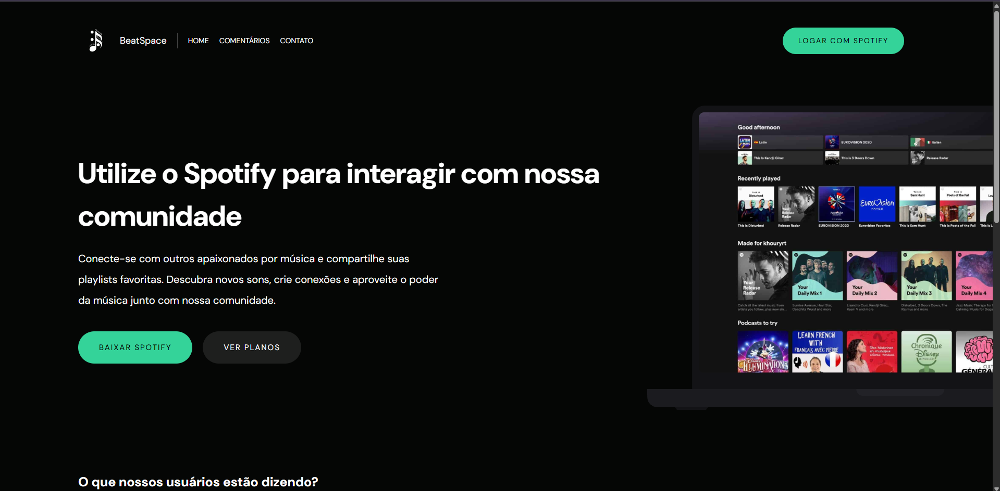

# BeatSpace  

### 🎵 Comunidade musical para usuários do Spotify  

BeatSpace é uma plataforma interativa onde os usuários podem resenhar álbuns, seguir outros membros, comentar e curtir resenhas, favoritar álbuns e criar playlists personalizadas, promovendo uma experiência social e colaborativa na música.  

### 🔗 Repositório do Back-end  
[BeatSpace-Back](https://github.com/Joaomarcos7/BeatSpace-Back)  

## 🚀 Tecnologias  

### 🎨 Front-end  
- TypeScript  
- HTML  
- Tailwind CSS  
- Angular  

### ⚙️ Back-end  
- Java (Spring Boot)  
- PostgreSQL  
- Redis  
- GraphQL  
- SCSS  

## 📸 Preview  

